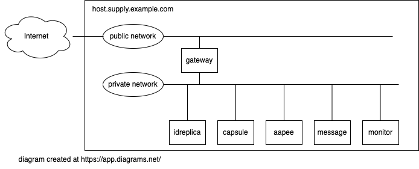

= Ansible playbook for turning a PC into a set of supply VMs

Ansible helps me assemble my home lab. 
This playbook turns a PC running RHEL 9 into a hypervisor running a pile-load (that's the technical term) of Virtual Machines. 
Each VM runs a set of services that support my home lab. 

. *gateway* hosts Bind, Squid, Postfix, NFS, haproxy, cockpit
. *idreplica* replica for Red Hat IDM (LDAP, CA, DNS)
. *capsule* proxy for Red Hat Satellite
. *aapee* Ansible Automation Platform Execution Environment node

Under construction. Sections marked with !!! and ??? are notes to self. 

== hardware

I use the playbook on this PC. 

* 64GB RAM 
* 1TB storage
* 4 core CPU

It's a lot of memory, and yet it isn't enough. 
It's never enough. 

== Operating System

I use the playbook on this OS. 

RHEL 9, fresh minimal install

== the KVM/QEMU hypervisor 

A bootstrap shell script kicks off the install. 
See instructions in 
https://github.com/nickhardiman/ansible-playbook-supply/blob/main/bootstrap.sh[bootstrap.sh].

== Virtual Machines

 

The https://github.com/nickhardiman/ansible-playbook-supply/blob/main/group_vars/all/main.yml[defaults file] defines a lot of values. 
For instance, most 
MAC addresses are set to ** 52:54:00:15:00:* **,  and 
IPv4 addresses are set to ** 192.168.15.* **. 

.guests attached to bridges
[%header,format=csv]
|===
name,         interface, MAC,               IP,              domain
*netpublic0*,    *brpublic0*, 52:54:00:14:00:01, (IPv4 address chosen by the home router),     home
host,              enp1s0,    52:54:00:14:00:02 (!!! failed to override real address), (another address from the home router's pool),     home
gateway,           enp1s0,    52:54:00:14:00:03, (another address from the home router's pool),     home

*netsupply0*,    *brsupply0*, 52:54:00:15:00:01, 192.168.15.1,   supply.example.com
         ,              ,     52:54:00:15:00:02, 192.168.15.2,   supply.example.com
gateway,          enp2s0,     52:54:00:15:00:03, 192.168.15.3,   supply.example.com
idreplica,        enp1s0,     52:54:00:15:00:04, 192.168.15.4,   supply.example.com
capsule,          enp1s0,     52:54:00:15:00:05, 192.168.15.5,   supply.example.com
aapee,            enp1s0,     52:54:00:15:00:06, 192.168.15.6,   supply.example.com
message,          enp1s0,     52:54:00:15:00:07, 192.168.15.7,   supply.example.com
monitor,          enp1s0,     52:54:00:15:00:08, 192.168.15.8,   supply.example.com
|===

== cheat sheet

=== PC and OS

Start with a machine running RHEL 9. 
A fresh minimal install is fine. 

Only tested on a box with one ethernet interface, plugged into the network.

=== edit the bootstrap script

Script 
https://github.com/nickhardiman/ansible-playbook-supply/blob/main/bootstrap.sh[bootstrap.sh] 
sets up everything on a freshly installed host. 

* Log into the hypervisor machine.
* Download the script.

[source,shell]
....
curl -O https://raw.githubusercontent.com/nickhardiman/ansible-playbook-source/main/bootstrap.sh
....

* Read the script 
* Follow the instructions and edit the script.

